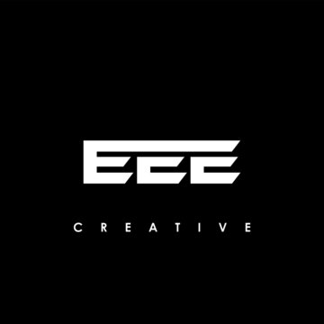
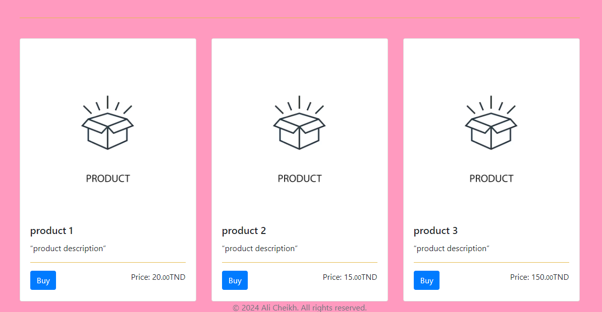
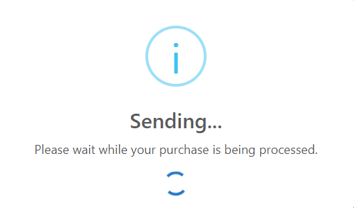
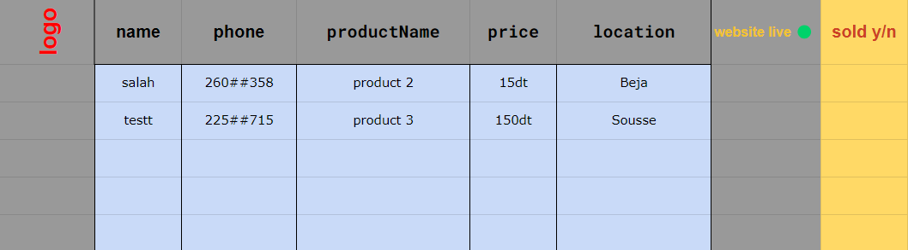

# EEE Store ✨

  

This is a simple web store for purchasing artworks created by Me. The store showcases various products with images and descriptions and allows users to make purchases.

## Website Preview

  

   
    

## Technologies Used

  
  
  
  
  
  
  
  
  

## Getting Started

To run this project locally:

1. Clone this repository.
2. Open the project folder in your preferred code editor.
3. Ensure you have a modern web browser installed.
4. Open the `index.html` file in your browser.

## Features

- Display of various artworks for sale.
  - Example: 
  
- Purchase functionality with confirmation dialogs.
- Collection of customer information (name, phone number, city) for order processing.
  - Data submitting : 
  
- Backend processing using Google Apps Script to submit purchase details to Google Sheets.
  - Storage view : 
  
- Responsive design for various screen sizes.
  - All screens thanks to bootstrap 

## Usage

To contribute to this project, follow these steps:

1. Fork the repository.
2. Clone the forked repository to your local machine.
3. Make changes and create a new branch.
4. Push your changes to the branch in your fork.
5. Open a pull request to the main branch of the original repository.

Upon opening a pull request, GitHub Actions will automatically run the CI workflow, testing your changes against multiple versions of Node.js. Ensure that all tests pass before merging your changes.

Simply open the `index.html` file in your web browser to explore and purchase artworks from eee-store.

## License

This project is licensed under the terms of the MIT license. See the [LICENSE](LICENSE.md) file for details.

---

© 2024 Ali Cheikh. All rights reserved.
